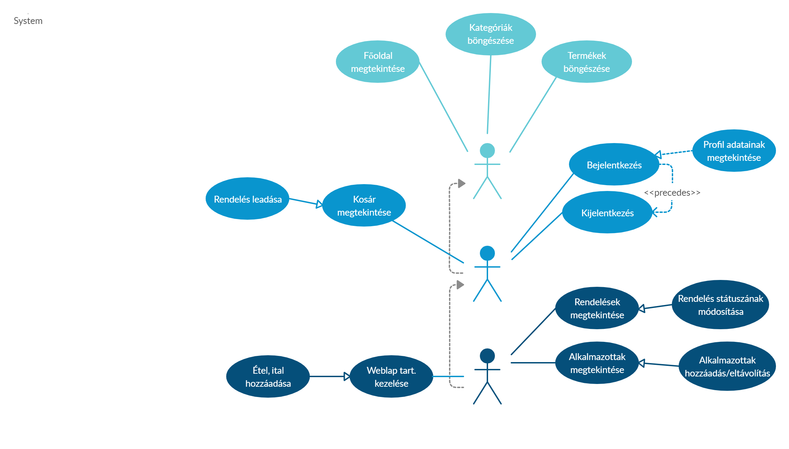
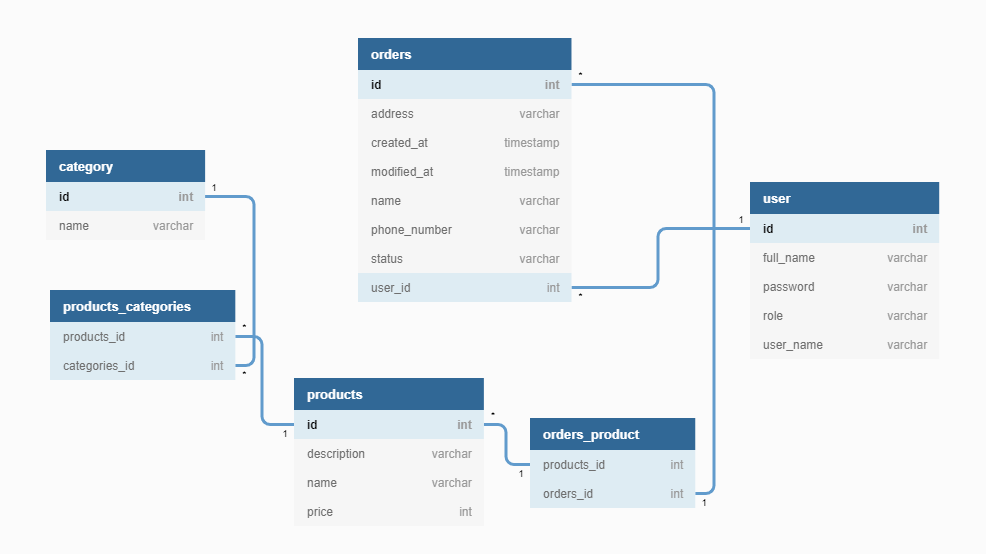
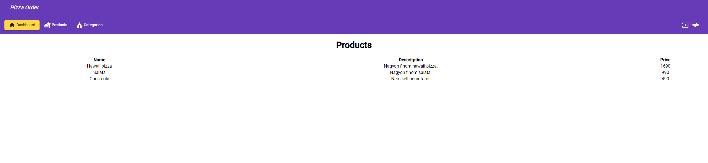

# pizzaorder-elte-project

# Web programming project at Eötvös Loránd University 

Description in hungarian:

## Pizzarendelés

Egy pizza-futár vállalat rendeléseket kezelő rendszer.
A megrendeléseket a vásárlók a webes felületen keresztül adhatják le.
* A weblap főoldalán megjelennek a kategóriák (pl. sonkás, hawaii, üdítők),
valamint a 10 legnépszerűbb (legtöbbet rendelt) étel/ital.
* A kategóriát kiválasztva listázódnak a tételek (név és ár kíséretében),
amelyek szűrhetőek név(részlet)re. Pizzák esetén leírás is van. Külön meg
vannak jelölve a csípős, illetve vegetáriánus ételek.
* Pizzák és italok tetszőleges számban helyezhetőek a kosárba egy adott
felső korlátig (20.000 Ft), afelett több terméket nem lehet a kosárba
helyezni.
* A kosár tartalma bármikor megtekinthető, ekkor látszódnak a felvett
tételek, illetve látható az összár. Bármely tétel kivehető a kosárból.
* A rendelést törölhetjük, illetve leadhatjuk. Utóbbi esetben meg kell
adnunk a nevünket, címünket, illetve telefonszámunkat, majd elküldhetjük
a rendelést.
A grafikus felületet az alkalmazottak használják a rendelések, illetve a weblap
tartalmának adminisztrálására.
* Az alkalmazott bejelentkezhet (felhasználónév és jelszó megadásával) a
programba, illetve kijelentkezhet.
* Bejelentkezve listázódnak a leadott, illetve teljesített rendeléseket (leadás
időpontja, teljesítés időpontja, név, cím, telefonszám, összeg), egy
rendelést kiválasztva pedig listázódnak a tételeket. A leadott rendelés
teljesítettnek jelölhető, ekkor a rendszer rögzíti a teljesítés időpontját is. A
lista szűrhető csak teljesített, illetve csak leadott rendelésekre, továbbá a
rendelő nevére, illetve cím(részlet)re.
* Lehetőség van új pizza, illetve ital hozzáadására (név, ár, illetve étel esetén
leírás, csípős/vegetáriánus tulajdonságok megadásával). Az egyértelműség
miatt nem engedélyezett több ugyanolyan nevű étel/ital felvitele.

### Szerepkörök
#### Szerepkörök bemutatása
 
* vendég *(GUEST)*: nem regisztrált látogató, a Főoldalt böngészheti, regisztrálhat, a termékeket nézheti, rendelést készíthet össze, adhat le
* tag *(USER)*: regisztrált, bejelentkezett látogató, ebben az esetben a cég alkalmazottja, aki a rendeléseket menedzselését hajtja végre, státuszt változtat, új terméket vesz fel
* adminisztrátor *(ADMIN)*: a rendeléseket menedzselését hajtja végre, új termékeket adhat az étel- és itallaphoz
 
#### Use-case modell

 
___

## Tervezés
### Oldaltérkép
* Regisztráció
* Bejelentkezés
* Főoldal
* Termékek böngészése
* Kategóriák megtekintése
* Rendelés leadása

#### Bejelentkezett felhasználóknak
* Rendelés megtekintése
  * Rendelés törlése
  * Státusz módosítása
* Új termék felvétele
* Kijelentkezés

### Oldaltérkép
* ` GET / ` Főoldal 
* ` GET / login` Bejelentkező oldal 
* ` POST / login ` Bejelentkezés
* ` POST / logout ` Kijelentkezés
* ` GET / users` Tagok listázása
* ` POST / users` Tagok hozzáadása 
* ` GET / products ` Termékek listázása 
* ` POST / products ` Termékek hozzáadása
* ` GET / orders ` Rendelések listázása
* ` GET / orders / {id} `  Rendelés szűrése *id* alapján
* ` GET / orders / {id} / products `  Termék kategóriájának megtekintése *id* alapján
* ` GET / orders / {id} / user ` Vásárló megtekintése *id* alapján
* ` POST / orders `  Rendelés leadása
* ` PATCH / orders / {id} `  Rendelés státuszának módosítása *id* alapján
* ` DELETE / orders / {id} ` Rendelés törlése *id* alapján
* ` GET / categories ` Kategóriák listázása
* ` GET / categories / {id} `  Kategóriák szűrése *id* alapján
* ` GET / categories / {id} / prodocuts`  Egy kategóriába tartozó termékek megjelenítése *id* alapján
*id - azonosító* 

### Osztálymodell
#### Adatbázisban tárold adatok
* kategóriák (név);
* pizzák és italok (név, kategória, leírás, ár, csípős-e, vegetáriánus-e);
* munkatársak (teljes név, felhasználónév, jelszó);
* rendelések (név, cím, telefonszám, megrendelt ételek és italok, teljesített-e)

#### Adatbázismodell

#### Design

___

## Implementáció
### Felhasznált eszközök
* [Git](https://git-scm.com/) verziókezelő
* [AngularJS](https://angularjs.org/) Javascript környezet
* [Spring Boot](https://spring.io/projects/spring-boot) keretrendszer
* [Github](https://github.com/) a projekt közzétételéhez

### Fejlesztőkörnyezet felállítása 
1. Git verziókezelő telepítése
 *Githubon történő regisztráció ajánlott*
2. Node.js környezet telepítése
3. Projekt klónozása lokális gépre: ` git clone https://github.com/csabahegedus/pizzaorder-elte-project.git `
4. A projektkönyvtárban a függőségek telepítése: npm i
5. App indítása: ` npm start ` vagy ` npm run dev `

#### Git
A master branchre mennek a fejlesztések folyamatosan. Új branch indítása innen lehetséges. 
___ 
 
## Teszteset leírása
 
### Rendelés leadása
1. Termékek böngészése
Erre lehetőség biztosított:
* a *Főoldalon*, melyen a 10 leggyakrabban rendelt termék jelenik meg. 
* a *Product* oldalon, melyen az összes, az áruházban szereplő és rendelhető termék megtalálható
* a *Categories* oldalon, melyen kategóriákra bontva találhatóak meg az egyes termékek.

2. A termékek böngészését követően a Create Order gombra kattintva készíthetünk rendelést
3. Az ételek/italok hozzáadását követően az oldal alján az ár folyamatosan változik a kosárban szereplő termékek függvényében
4. Rendelés leadása a *Rendelés* gomb segítségével

### Alkalmazottak lehetőségei (*Státuszmódosítás*)
1. A jobb felső sarokban található login gombra kattintva bejelentkezés a megfelelő felhasználónév és jelszó párossal
2. My Orders menüre kattintás (*Itt kilistázódik az összes rendelés, névvel, címmel, megrendelt tétellel és státusszal*)
3. Az egyes rendelésekre kattinva az új státusz kiválasztható, menthető
___
 
## Felhasználói dokumentáció
 
### Termékek böngészése
A Főoldalon - *Dashboard* a legnépszerűbb termékeket láthatod, melyeket a kosaradba helyezhetsz.
A Termékek - *Product* oldalon az összes terméket listázva láthatod, melyek közül választhatsz, hogy mit szeretnél rendelni. Itt kerül feltüntetésre valamennyi elérhető termék, leírással, árral feltüntetve.
A Kategóriák - *Categories* oldalon lehetőséges nyílik az egyes termékeket kategóriákra bontva megtekinteni.
 
Az egyes oldalon elhelyezett termékeket a kosárba helyezheted, összeállítva így a kívánt rendelést. 
 
A kosár tartalma bármikor megtekinthető, ekkor látszódnak a felvett tételek, illetve látható az összár. Bármely tétel kivehető a kosárból a termékek melletti megfelelő gombra kattintva.
 
### Rendelés leadása
A *Create Order* menüpontra kattintva van lehetőséged új rendelést leadni. A kosárba helyezett termékek összára folyamatosan látható. Az összes kiválasztott tétel után szükségesen megadandó adatok: a nevünk, címünk, illetve telefonszámunk. Ezt követően lehetőség van a rendelés leadására az Rendelés gomb segítségével. 
 
### Rendelések kezelése
A bejelentkezés a jobb felső sarokban elhelyezett ` Login ` gombbal lehetséges. Erre kattintva a felhasználónév és jelszó párost megadva az alkalmazottak beléphetnek az oldal további területeire.
Amennyiben bejelentkeztél az oldalra, láthatod a korábban leadott rendeléseket, valamint menedzselheted a leadott rendeléseket. Az előbb említett műveletek elvégzésére a *My Orders* menüpont alatt van lehetőséged. Erre kattintva megjelenik a felhasználóhoz tartozó rendelések táblázatos formában listázva. Itt látható a *Név*, *Kiszállítási cím*, *Rendelt termékek* és a *Rendelés státusza*. A leadott rendelések státuszát állíthatják be annak megfelelően, hogy Teljesítve van-e már a rendelés, most készül, vagy még újként szerepel a rendszerben. 
 
### Új termékeke felvétele
Kizárólag az alkalmazottak adhatnak új termékeket a webáruház kínálatához. Az egyértelműség miatt nem engedélyezett több ugyanolyan nevű étel/ital felvitele.

### Profil adatainak megtekintése
A jobb felső sarokban elérhető a Profil kizárólag bejelentkezett személyek számára. Erre a menüpontra kattintva a legördülő listával a *Details* almenüre kattintva megtekinthetőek a bejelentkezett felhasználó részletes adatai.
 
